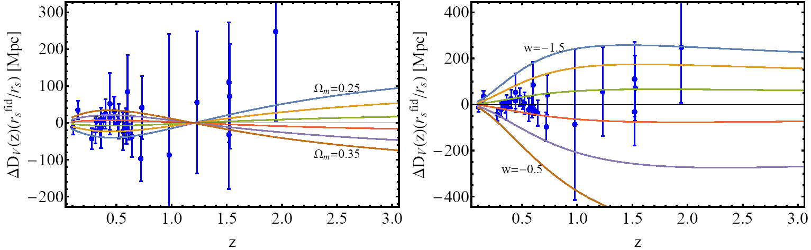

# Constraining Power of Cosmological Observables: Blind Redshift Spots and Optimal Ranges.

This is the repository that includes the Mathematica code (in .zip format) as well as useful comments that reproduce the figures of [10.1103/PhysRevD.99.063537](https://journals.aps.org/prd/abstract/10.1103/PhysRevD.99.063537) which can also be found in [arxiv:1812.05356](https://arxiv.org/pdf/1812.05356.pdf).

## Abstract 
A cosmological observable measured in a range of redshifts can be used as a probe of a set of cosmological parameters. Given the cosmological observable and the cosmological parameter, there is an optimum range of redshifts where the observable can constrain the parameter in the most effective manner. For other redshift ranges the observable values may be degenerate with respect to the cosmological parameter values and thus inefficient in constraining the given parameter. These are blind redshift ranges. We determine the optimum and the blind redshift ranges of basic cosmological observables with respect to three cosmological parameters: the matter density parameter &Omega;m, the equation of state parameter w (assumed constant), and a modified gravity parameter g&alpha; which parametrizes a possible evolution of the effective Newton's constant as  (where  is the scale factor and  is Newton's constant of General Relativity). We consider the following observables: the growth rate of matter density perturbations expressed through f(z) and f&sigma;8(z), the distance modulus &mu;(z), baryon acoustic oscillation observables ,  and , H(z) measurements and the gravitational wave luminosity distance. We introduce a new statistic 

, 

including the effective survey volume , as a measure of the constraining power of a given observable O with respect to a cosmological parameter P as a function of redshift z. We find blind redshift spots zb () and optimal redshift spots zs () for the above observables with respect to the parameters &Omega;m, w and g&alpha;. For example for  and  we find blind spots at , respectively,  and optimal (sweet) spots at . Thus probing higher redshifts may in some cases be less effective than probing lower redshifts with higher accuracy. These results may be helpful in the proper design of upcoming missions aimed at measuring cosmological obsrevables in specific redshift ranges.  

## Citing the paper 
If you use any of the above codes or the figures in a published work please cite the following paper:
 *Constraining power of cosmological observables: blind redshift spots and optimal ranges.*
 Lavrentios Kazantzidis, Leandros Perivolaropoulos and Foteini Skara
 [Phys. Rev. D 99 (2019), 063537](https://journals.aps.org/prd/abstract/10.1103/PhysRevD.99.063537), [arxiv:1812.05356](https://arxiv.org/pdf/1812.05356.pdf)

Any further questions/comments are welcome.

## Authors List
Lavrentios Kazantzidis - <lkazantzi@cc.uoi.gr>
 Leandros Perivolaropoulos - <leandros@uoi.gr>
 Foteini Skara - <fskara@cc.uoi.gr>
